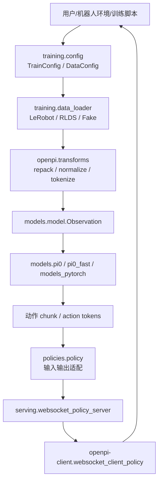
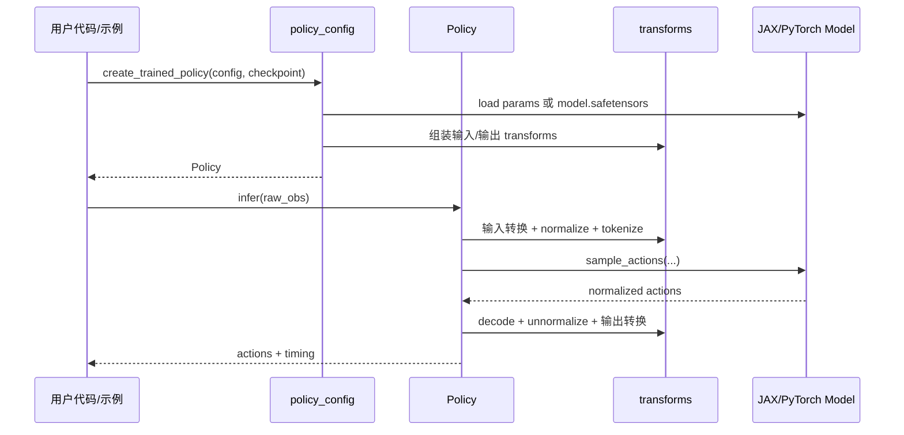
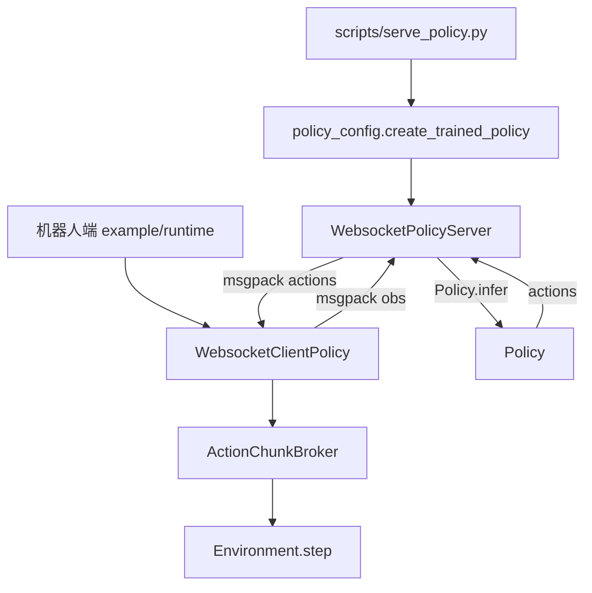
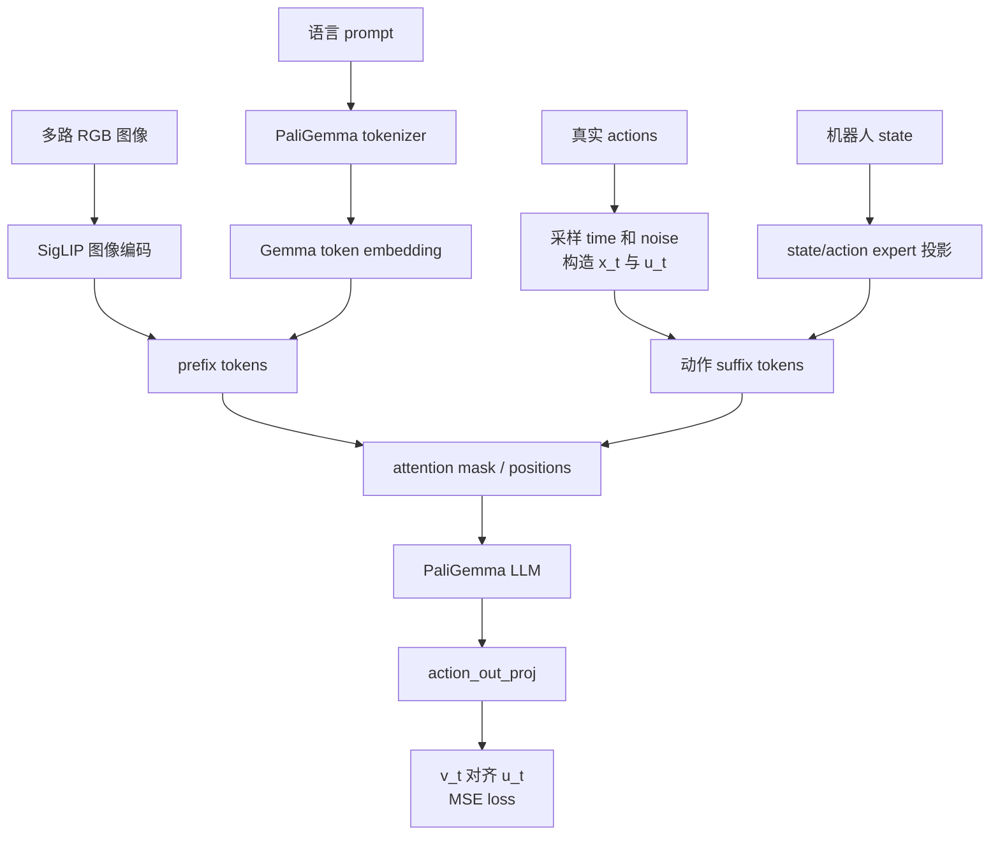
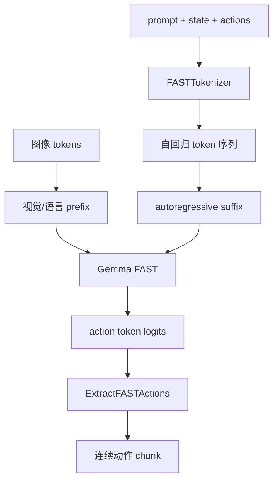
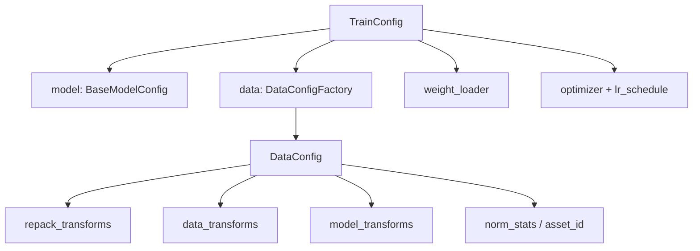

# openpi 流程图

## 总体架构



## 数据生命周期

```mermaid
flowchart LR
    Raw["原始样本<br/>LeRobot / RLDS / 环境 obs"] --> Repack["RepackTransform"]
    Repack --> RobotTransform["机器人专用 transform<br/>ALOHA / DROID / LIBERO"]
    RobotTransform --> Norm["Normalize<br/>z-score / quantile"]
    Norm --> ModelTransform["模型 transform<br/>resize / tokenize / pad"]
    ModelTransform --> Dict["统一 dict<br/>image / image_mask / state / tokens / actions"]
    Dict --> Obs["Observation.from_dict"]
    Obs --> Model["compute_loss / sample_actions"]
    Model --> OutTransform["输出反变换<br/>decode / unnormalize / robot outputs"]
    OutTransform --> Action["机器人动作"]
```



## 训练调用链

```mermaid
sequenceDiagram
    participant CLI as scripts/train.py
    participant Config as training.config
    participant Loader as training.data_loader
    participant Model as models.BaseModel
    participant Opt as training.optimizer
    participant Ckpt as training.checkpoints

    CLI->>Config: cli() 解析 TrainConfig
    CLI->>Loader: create_data_loader(config)
    Loader->>Config: data.create(...)
    Loader->>Loader: 创建 dataset 并应用 transforms
    CLI->>Model: config.model.create(init_rng)
    CLI->>Model: weight_loader 加载预训练参数
    CLI->>Opt: create_optimizer(...)
    loop train step
        Loader-->>CLI: Observation, Actions
        CLI->>Model: compute_loss(...)
        CLI->>Opt: value_and_grad + update
        CLI->>Ckpt: save_state(...)
    end
```

## 推理调用链



## 远程推理



## pi0 / pi05 Flow Matching



## pi0-FAST



## 配置系统


